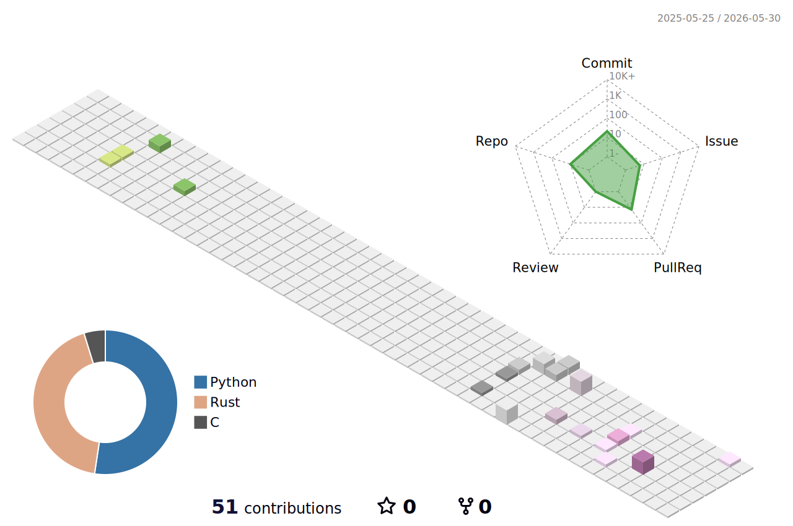

<!-- Header with Wave Animation -->

<!-- Typing Animation -->

  

--- 

### About Me

Systems Programmer deeply passionate about low-level engineering, performance optimization.

- 📫 Reach me: yusq77@gmail.com
- ⚡ Deeply interested in System Kernels and AI

## Tech Stack

  

## GitHub Analytics

<!-- GitHub Stats Grid - Better Alignment -->

  <table>
    <tr>
      <td align="center">
        
      </td>
      <td align="center">
        
      </td>
    </tr>
    <tr>
      <td align="center">
        
      </td>
      <td align="center">
        
      </td>
    </tr>
  </table>

 

<!-- GitHub Streak Stats -->

  

 

<!-- Profile Details Card - Full Width -->

  

 

## 3D Contribution Graph

  

